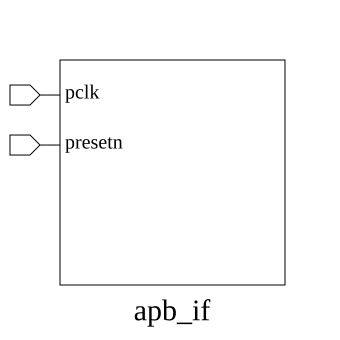

# apb_if (interface)

### Source: apb_if.sv

## Top IO

## Parameters

_None_

## Ports

|Name|Direction|Type|Dimension|Description|
|-|-|-|-|-|
|pclk|input|logic|||
|presetn|input|logic|||

## Description

_No top-level description found._
