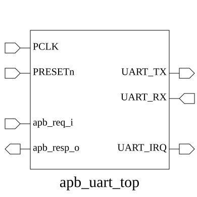

# apb_uart_top (module)

### Author: Ahasan Ullah Khalid (aukhalid02@gmail.com)

### Source: apb_uart_top.sv

## Top IO

## Parameters

|Name|Type|Dimension|Default|Description|
|-|-|-|-|-|
|ADDR_WIDTH|int||32|Width of the APB address bus|
|DATA_WIDTH|int||32|Width of the APB data bus|
|FIFO_SIZE|int||4|log2(16) -> Depth of 16 for FIFOs|

## Ports

|Name|Direction|Type|Dimension|Description|
|-|-|-|-|-|
|PCLK|input|logic||APB Clock|
|PRESETn|input|logic||APB Reset (Active Low)|
|PADDR|input|logic [ADDR_WIDTH-1:0]||APB Address|
|PSEL|input|logic||APB Select|
|PENABLE|input|logic||APB Enable|
|PWRITE|input|logic||APB Write Enable|
|PWDATA|input|logic [DATA_WIDTH-1:0]||APB Write Data|
|PRDATA|output|logic [DATA_WIDTH-1:0]||APB Read Data|
|PREADY|output|logic||APB Ready|
|PSLVERR|output|logic||APB Slave Error|
|UART_TX|output|logic||UART Transmit Data|
|UART_RX|input|logic||UART Receive Data|
|UART_IRQ|output|logic||UART Interrupt Request|

## Description

### Purpose
The `apb_uart_top` module serves as the top-level wrapper for a Universal Asynchronous Receiver-Transmitter (UART) peripheral, designed to interface with an Advanced Peripheral Bus (APB). It integrates register-based configuration, clock division, FIFO buffering for both transmission and reception, and the core UART serial communication logic.

### Use Case
This module is intended to be integrated into SoC designs as a standard serial communication peripheral. It allows a system processor (via the APB bus) to configure baud rates, frame formats (data bits, parity, stop bits), and manage data flow through hardware FIFOs. It is ideal for applications requiring asynchronous serial communication, such as debug consoles, sensor interfacing, or inter-chip communication where low pin-count connectivity is required.

| REVISION | DATE       | AUTHOR              | DESCRIPTION                                            |
|----------|------------|---------------------|--------------------------------------------------------|
| 0.1      | 2026-08-13 | Ahasan Ullah Khalid | Initial version                                        |
| 1.0      | 2026-08-17 | Ahasan Ullah Khalid | Stable release                                         |

Author : Ahasan Ullah Khalid (aukhalid02@gmail.com)
