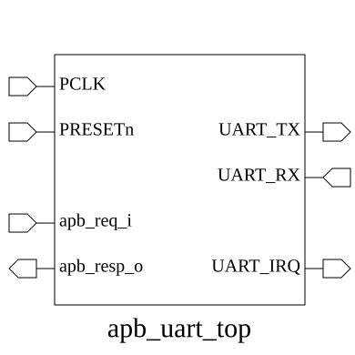

# apb_uart_top (module)

### Author: Ahasan Ullah Khalid

### Source: apb_uart_top.sv

## Top IO

## Parameters

|Name|Type|Dimension|Default|Description|
|-|-|-|-|-|
|ADDR_WIDTH|int||32|APB address width|
|DATA_WIDTH|int||32|APB data width|
|FIFO_SIZE|int||4|FIFO depth is 2**FIFO_SIZE entries|

## Ports

|Name|Direction|Type|Dimension|Description|
|-|-|-|-|-|
|PCLK|input|logic||APB clock|
|PRESETn|input|logic||Active-low reset|
|apb_req_i|input|apb_req_t||APB request|
|apb_resp_o|output|apb_resp_t||APB response|
|UART_TX|output|logic||UART transmit|
|UART_RX|input|logic||UART receive|
|UART_IRQ|output|logic||UART interrupt|

## Description

Module: apb_uart_top
Author: Ahasan Ullah Khalid
Brief: APB-controlled UART with asynchronous transmit and receive FIFOs.
SPDX-License-Identifier: MIT
